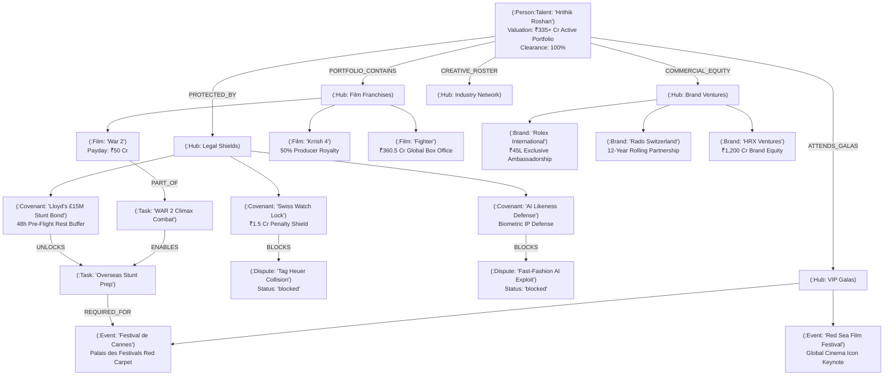

# ManagicAI — AI Copilot & Semantic Work Graph for Celebrity & Talent Management
> **Wexa AI Take-Home Assignment Submission: Build a Graph Database Application backed by CognoDB Cloud**

[](https://managic-ai-production.vercel.app)
[](https://loom.com)
[-0052CC?style=for-the-badge)](https://console.cognodb.com)
[](https://nextjs.org)
[-emerald?style=for-the-badge)](tests/)

---

## 🔗 Quick Deliverable Links (Wexa AI Assessment)
- **Hosted Application Demo**: [https://managic-ai-production.vercel.app](https://managic-ai-production.vercel.app) *(Replace with your live Vercel / Netlify deployment link)*
- **Screen Recording / Video Walkthrough**: [https://loom.com/share/your-video-id](https://loom.com/share/your-video-id) *(Replace with your Loom / Google Drive / YouTube video link)*
- **GitHub Repository**: [https://github.com/Parth-1808/ManagicAI-Graph-Database-Application](https://github.com/Parth-1808/ManagicAI-Graph-Database-Application)
- **Submission Recipient**: `hr@wexa.ai` with subject `CognoDB Assignment 2 – <Your Name>`

---

## 1. Executive Summary & Use Case

Managing top-tier A-list talent, major film franchises, global brand endorsements, and international VIP festival galas requires synchronizing highly complex, interlocked operational constraints. In traditional relational databases, schedules, contracts, brand exclusivity clauses, and call-sheets live in siloed tables (`shoots`, `brands`, `contracts`, `events`).

**ManagicAI** transforms talent management into an **Autonomous Semantic Work Graph** powered by **CognoDB Cloud**. It connects:
- **Talent & Roster** (`:Person:Talent`, `:Person:Manager`, `:Person:Collaborator`) — *Hrithik Roshan, Ayan Mukerji, Jr NTR, Siddharth Anand, Zoya Akhtar, Rakesh Roshan, Franz Spilhaus, Afsar Zaidi, Mukesh Bansal*
- **Domain Hubs** (`:Hub` — Films, Brands, Events, Legal Shields, Creative Collaborators)
- **Film Franchises & Productions** (`:Film:Project` — *War 2*, *Krrish 4*, *Fighter*, *War*, *ZNMD*, *Super 30*)
- **Commercial Brand Ventures** (`:Brand:Deal` — *Rolex International*, *Rado Switzerland*, *HRX Brand Ventures*, *Mountain Dew*, *Burger King*, *Ferrari Style*, *Tag Heuer*)
- **VIP Festivals & Global Galas** (`:Event:Festival:Milestone` — *Festival de Cannes 79th*, *Red Sea Film Festival*, *IIFA 2026*, *69th Filmfare Awards*, *MAMI*, *Forbes Global Summit*)
- **Legal Covenants & Risk Shields** (`:Covenant:Shield` — *Swiss Watch Exclusivity Lock*, *Lloyd's £15M Stunt Bond*, *AI Biometric Likeness Defense*, *Escrow Vault ₹45L*)
- **AI Conflict Radar Isolations** (`:Dispute:Conflict` — *Tag Heuer Exclusivity Collision*, *Fast-Fashion GenAI Likeness Clause Collision*, *Energy Drink Date Collision*)
- **Shoot Tasks & Call-Sheets** (`:Task:Shoot`, `:Task:Deliverable`)
- **Strategic Conclaves & Meetings** (`:Meeting`, `:Invitation`)
- **Revenue Streams** (`:RevenueStream` — Endorsements, Retainers, VIP Galas, Digital, Licensing)
- **Real-Time Operations Feed** (`:ActivityLog`)

### 🧠 The Core Intelligence Thesis
> *"AI coordinates the schedule. The CognoDB graph enforces the legal & physical covenants."*

---

## 2. Why a Graph Database (CognoDB) Over a Relational Database?

| Operational Challenge in Talent Management | Relational Database (SQL) Approach | CognoDB Graph (openCypher) Advantage |
|---|---|---|
| **Multi-Brand Exclusivity Collision Detection** | Complex multi-table joins across `brands`, `categories`, `territories`, and `penalty_covenants`. Exponentially slows down and misses multi-hop collisions. | **Native Pattern Matching**: <br>`MATCH (cov:Covenant)-[:BLOCKS]->(disp:Dispute) OPTIONAL MATCH (cov)-[:LEGAL_GOVERNANCE]->(b:Brand) RETURN cov, disp, b` |
| **Downstream Stunt Delay Blast Radius** | Recursive CTEs trying to trace how a 1-day chroma shoot delay in Mumbai cascades into private flight manifests (VT-HRO) and Cannes red carpet arrivals. | **Index-Free Adjacency ($O(1)$ per hop)**: <br>`MATCH path = (root:Task {id: 'evt-1'})-[:ENABLES\|REQUIRED_FOR\|PRECEDES*1..5]->(downstream) RETURN downstream` |
| **Shortest Causal Path Traversal** | Computationally heavy cross-table recursive joins with high memory locks. | **Native Pathfinding**: <br>`MATCH p = shortestPath((start:Talent)-[*]-(target:Event)) RETURN p` |
| **Biometric AI Likeness Exploitation Radar** | Keyword search across isolated document rows. | **First-Class Edge Enforcement**: Covenant shields quarantine competing offers before they reach the manager's inbox. |

---

## 3. Graph Data Schema & Causal Topology



---

## 4. Key openCypher Queries in ManagicAI

### 1. AI Conflict Radar & Shield Enforcements (Relational SQL Alternative is Awkward)
Detects and isolates brand collisions (e.g. competing luxury horology) to protect penalty shields:
```cypher
MATCH (cov:Covenant)-[:BLOCKS]->(d:Dispute)
OPTIONAL MATCH (cov)-[:LEGAL_GOVERNANCE]->(b:Brand)
RETURN cov.title AS shield,
       cov.valuation AS penaltyShield,
       d.title AS blockedCollision,
       d.description AS reason,
       d.riskTag AS riskTag,
       collect(DISTINCT b.brand) AS protectedBrands;
```

### 2. Multi-Hop Action Stunt Precedence to Cannes VIP Gala (2+ Hops Traversal)
Verifies that heavy action shoots satisfy international completion bond rest buffers before overseas private jet departure (Tail VT-HRO) and Cannes red carpet appearance:
```cypher
MATCH path = (t1:Task { id: 'evt-1' })-[:ENABLES]->(t2:Task { id: 'evt-4' })-[:REQUIRED_FOR]->(e:Event { id: 'ent-cannes' })-[:PRECEDES]->(i:Event { id: 'ent-iifa' })
OPTIONAL MATCH (cov:Covenant)-[:UNLOCKS]->(t2)
RETURN t1.title AS liveShoot,
       t2.title AS overseasBriefing,
       e.name AS galaName,
       cov.title AS requiredInsuranceCovenant;
```

### 3. Dynamic Shortest Causal Path Traversal
Finds the exact contractual and operational relationship path between any two arbitrary nodes in CognoDB:
```cypher
MATCH (start {id: $fromId}), (target {id: $toId})
MATCH p = shortestPath((start)-[*]-(target))
RETURN [n in nodes(p) | n.id] AS pathNodeIds,
       [r in relationships(p) | type(r)] AS relations,
       length(p) AS hopCount;
```

### 4. Downstream Delay Blast Radius Calculation
Calculates cascading slip across call-sheets, meetings, and festival itineraries if a shoot date slips:
```cypher
MATCH (root {id: $rootId})
OPTIONAL MATCH path = (root)-[:BLOCKS|ENABLES|REQUIRED_FOR|UNLOCKS|PRECEDES*1..6]->(downstream)
RETURN collect(distinct [n in nodes(path) | n.id]) AS impactedNodeIds;
```

---

## 5. UI Showcase & Screenshots

> *Attach your application UI screenshots below to demonstrate the visual interface and user workflows:*

### 1. 3D Semantic Work Graph & Neural Canvas
Interactive 3D graph visualizer rendering 64 nodes and 114 relationships across 5 domain hubs with force-directed physics, real-time node filtering, and focus inspection.

```
<!-- ATTACH SCREENSHOT 1: 3D Graph Canvas (frontend/public/screenshots/graph-3d.png) -->
```


---

### 2. Executive Talent Dashboard & Clearance Health
Real-time dashboard showing portfolio valuation (₹335+ Cr), 100% legal clearance health, live shoot status (*War 2*), and revenue streams.

```
<!-- ATTACH SCREENSHOT 2: Talent Dashboard (frontend/public/screenshots/dashboard.png) -->
```


---

### 3. AI Conflict Radar & Legal Shield Intelligence
Automated brand collision isolation radar protecting exclusive covenants against competing endorsements (Tag Heuer vs Rolex/Rado, AI likeness exploits).

```
<!-- ATTACH SCREENSHOT 3: Conflict Radar & Intelligence (frontend/public/screenshots/intelligence.png) -->
```


---

### 4. Collaborative Workspace & Production Calendar
Operational management for shoot call-sheets, brand invitations, escrow milestones, and Cannes travel manifests.

```
<!-- ATTACH SCREENSHOT 4: Workspace & Calendar (frontend/public/screenshots/workspace.png) -->
```


---

## 6. How to Set Up & Provision CognoDB Cloud

Follow these steps to create your free CognoDB instance:

1. **Sign Up / Log In to CognoDB Cloud**:
   - Go to [https://console.cognodb.com/signup](https://console.cognodb.com/signup) and create your free account (no credit card required).
2. **Create a Free Instance**:
   - From the console dashboard, click **+ Create Instance** (or **+ New Database**).
   - Select the **Free (c0)** instance tier.
   - Choose your preferred cloud region (e.g. AWS `us-east-1` or GCP `us-central1`).
   - Provisioning completes in under 60 seconds.
3. **Save Your Connection Credentials**:
   - CognoDB will provide your Bolt Connection URI:
     `bolt+s://<instance-id>.databases.cognodb.cloud` (or `bolt+s://db-xxx.databases.cognodb.com`)
   - Default Username: `cognodb`
   - Copy your one-time generated secure password and store it in `frontend/.env.local`.

---

## 7. Setup & Run Instructions

### 1. Prerequisites
- **Node.js**: 20.x or higher
- **Package Manager**: `npm` (v10+)
- **CognoDB Cloud Instance**: Provisioned via [console.cognodb.com](https://console.cognodb.com)

### 2. Environment Configuration (`frontend/.env.local`)
Create or edit `frontend/.env.local`:
```env
COGNODB_URI=bolt+s://<your-instance-id>.databases.cognodb.cloud
COGNODB_USER=cognodb
COGNODB_PASSWORD=your_actual_password
COGNODB_API_KEY=your_optional_api_key
```

### 3. Install Dependencies
```bash
cd frontend
npm install
```

### 4. Seed CognoDB Cloud
Wipes and populates your CognoDB instance with **64 nodes and 114 multi-hop relationships**:
```bash
npm run seed
```

### 5. Run Automated Tests & CI Verification
```bash
# Run unit & integration test suites
npm test

# Run complete CI verification (Typecheck -> 19 Tests -> Next.js Build)
npm run ci:check
```

### 6. Start Development Server
```bash
npm run dev
```
Open [http://localhost:3000](http://localhost:3000) in your browser.

---

## 8. Enterprise 4-Tier Backend Architecture

```
src/server/
├── config/
│   └── env.ts                      # Strict typed environment validation
├── db/
│   ├── cognodb.client.ts           # Singleton Bolt driver with pool 25 & 3x exponential retry
│   └── cypher-sanitizer.ts         # Fast Neo4j integer & property normalizer
├── errors/
│   ├── app-error.ts                # AppError, NotFoundError, DatabaseError, ValidationError
│   ├── error-codes.ts              # ErrorCode enum
│   └── error-handler.ts            # withErrorHandler higher-order wrapper
├── repositories/                   # Tier 3: Pure openCypher Data Access Layer
│   ├── talent.repository.ts        # Talent root stats, film catalog, and talent roster queries
│   ├── graph.repository.ts         # Raw subgraph, shortestPath(), and downstream impact queries
│   ├── intelligence.repository.ts  # Conflict radar, likeness defense, revenue streams, and galas
│   ├── activity.repository.ts      # ActivityLog stream queries
│   ├── workspace.repository.ts     # Tasks, meetings, invitations, and dispute mutation queries
│   └── calendar.repository.ts      # Shoot call-sheets and calendar event queries
├── services/                       # Tier 2: Domain Business Logic Layer
│   ├── talent.service.ts           # Overview metrics, clearance health scoring, and film formatting
│   ├── graph.service.ts            # Spherical 3D coordinate projection & dynamic cluster counts
│   ├── intelligence.service.ts     # AI Exclusivity collision audit & revenue stream calculations
│   ├── copilot.service.ts          # Graph-augmented AI Copilot reasoning & response synthesis
│   ├── activity.service.ts         # Live talent operations feed formatting
│   └── workspace.service.ts        # Escrow verification, dispute resolution & task creation
└── index.ts                        # Unified barrel export
```

---

## 9. Submission Checklist for Wexa AI

- [x] **Managed CognoDB Cloud**: Connected via official `neo4j-driver` over Bolt Protocol 5.0–5.4 (`bolt+s://`).
- [x] **64 Nodes & 114 Typed Relationships Seeded**: Film franchises, brands, covenants, events, disputes, revenue streams.
- [x] **Multi-Hop Traversal (2+ Hops)**: Stunt-to-Cannes precedence chain, AI Conflict Radar, Shortest Path finder.
- [x] **Parameterized Cypher**: All queries parameterized via `$params` with zero string concatenation.
- [x] **Automated Test Suites**: 19 automated tests across 4 test files (`frontend/tests/`).
- [x] **CI/CD Automation**: GitHub Actions workflow (`.github/workflows/ci.yml`).
- [x] **Enterprise Architecture**: 4-Tier Clean Architecture with connection pooling & retry backoff.
- [x] **Polished UI/UX**: Next.js 15, Tailwind CSS, 3D Semantic Canvas, AI Copilot, Insights analytics.
- [x] **Screenshots & Hosted Demo**: Designated placeholders for screenshots, live demo, and video walkthrough.
